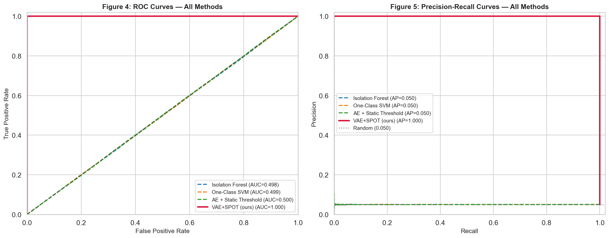
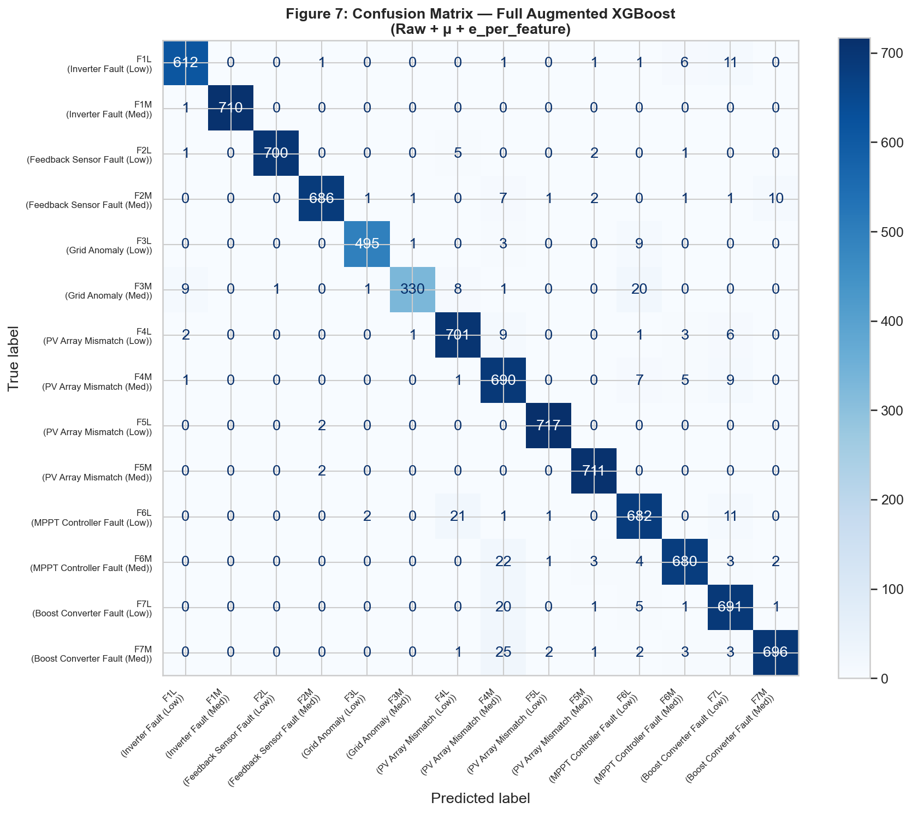
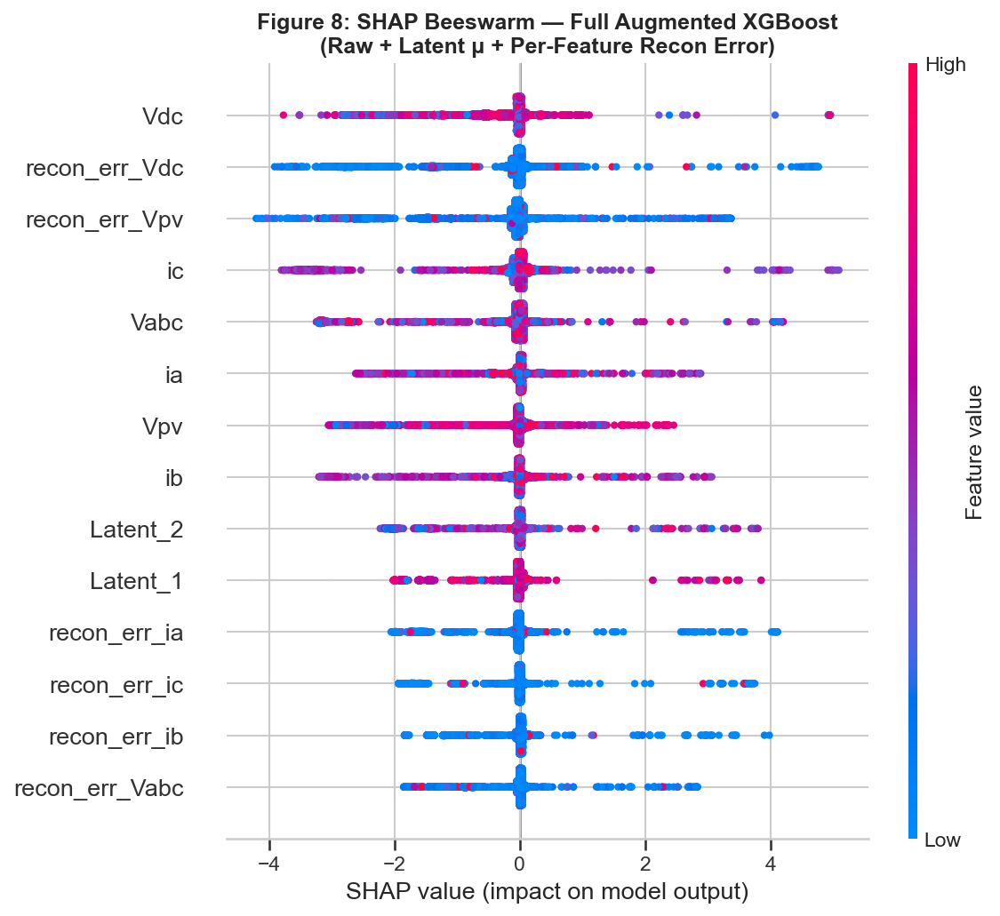
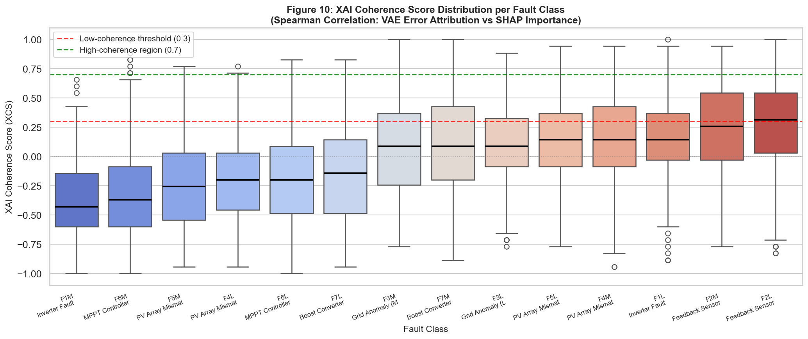

# SmartGrid Anomaly Detection

> **Autoencoder-Based Anomaly Detection with Explainable Insights for Smart Grid Faults**

A multi-stage fault diagnosis pipeline for PV/smart grid systems that combines unsupervised deep learning, extreme value theory, and explainable AI into a single cohesive framework.

[](https://www.python.org/)
[](https://pytorch.org/)
[](https://xgboost.readthedocs.io/)
[](LICENSE)

---

## Overview

This project implements a novel three-stage pipeline for detecting and diagnosing faults in photovoltaic (PV) smart grid systems:

| Stage | Component | Description |
|-------|-----------|-------------|
| 1 | **VAE** | Variational Autoencoder trained on normal operation data for unsupervised anomaly detection |
| 2 | **EVT Thresholding** (Novelty 1) | SPOT/DSPOT-based adaptive thresholds using Extreme Value Theory for robust anomaly labelling |
| 3 | **Latent-Augmented XGBoost + XCS** (Novelty 2) | Fault classifier enhanced with VAE latent features, explained via SHAP and a novel XAI Coherence Score (XCS) |

### Key Results

| Stage | Method | F1 Score |
|-------|--------|----------|
| Anomaly Detection | **VAE + SPOT (ours)** | **0.9864** |
| Anomaly Detection | One-Class SVM (best baseline) | 0.0820 |
| Fault Classification | **Full Augmented XGBoost** | **0.9683** |
| Fault Classification | Raw Features Only | 0.9677 |

**+90.4% F1 improvement over the best baseline.**

---

## Repository Structure

```
SmartGridAnomalyDetection/
├── notebooks/                          # Run these in order (Steps 1–6)
│   ├── VAE_TRAIN.ipynb                 # Step 1 — Train VAE on normal data
│   ├── VAE_TEST.ipynb                  # Step 2 — VAE inference (run 3×)
│   ├── EVT_Adaptive_Thresholding.ipynb # Step 3 — Novelty 1: EVT thresholding
│   ├── Latent_Augmented_XGBoost_XCS.ipynb  # Step 4 — Novelty 2: XGBoost + XCS
│   ├── Baselines_Comparison.ipynb      # Step 5 — Compare against baselines
│   └── Classifier + Tree Shap.ipynb   # Step 6 — SHAP deep-dive (optional)
│
├── scripts/
│   └── preprocessor.py                # Raw dataset preprocessing (variance filtering, scaling)
│
├── models/
│   └── best_vae_model.pt              # Saved VAE weights (produced by Step 1)
│              [not tracked by git — see note below]
│
├── data/                              # Place your CSV files here (gitignored — large files)
│   ├── vae_train.csv
│   ├── vae_test.csv
│   └── vae_test2.csv
│
├── results/
│   ├── figures/                       # All output plots (PNG)
│   │   ├── figure2_recon_error_distribution.png
│   │   ├── figure3_adaptive_threshold_tracking.png
│   │   ├── figure4_5_roc_pr_all_methods.png
│   │   ├── figure7_confusion_matrix.png
│   │   ├── figure8_shap_beeswarm.png
│   │   ├── figure9_ablation_bar_chart.png
│   │   └── figure10_xcs_boxplot.png
│   └── tables/                        # Output CSV tables
│       ├── evt_ablation_table.csv
│       ├── latent_augmented_ablation_table.csv
│       └── full_baseline_comparison_table.csv
│
├── .github/
│   └── workflows/
│       └── lint.yml                   # CI — check notebooks for syntax errors
│
├── .gitignore
├── environment.yml                    # Conda environment spec
├── requirements.txt                   # pip requirements
├── LICENSE
└── README.md
```

---

## Setup

### Prerequisites

- Python 3.10
- Conda (recommended) or pip

### 1 — Clone the repository

```bash
git clone https://github.com/<your-username>/SmartGridAnomalyDetection.git
cd SmartGridAnomalyDetection
```

### 2 — Create environment

**With conda (recommended):**
```bash
conda env create -f environment.yml
conda activate smartgrid
```

**With pip:**
```bash
pip install -r requirements.txt
```

>  **Important:** Use `xgboost==2.1.1` exactly. XGBoost 3.x is incompatible with SHAP 0.49.x and will raise a `ValueError` during SHAP computation.

### 3 — Add data files

Place these three CSV files in the `data/` directory:

```
data/
├── vae_train.csv      ← normal operating data for VAE training
├── vae_test.csv       ← unlabeled test data
└── vae_test2.csv      ← labeled test data (contains 'source' fault column)
```

>  **Data source:** The raw dataset originates from PV fault simulation data (F0L–F7L, F0M–F7M). Use `scripts/preprocessor.py` to generate the CSVs from raw simulation files if starting from scratch.

---

## Running the Pipeline

Run the notebooks **in order**. Each step depends on outputs from the previous step.

### Step 1 — Train VAE

```
Notebook: notebooks/VAE_TRAIN.ipynb
Input:    data/vae_train.csv
Output:   models/best_vae_model.pt
Time:     ~2 min
```

Open the notebook and run all cells. This trains the Variational Autoencoder on normal operating data and saves the best model checkpoint.

---

### Step 2 — VAE Inference (run 3 times)

```
Notebook: notebooks/VAE_TEST.ipynb
Input:    vae_train.csv / vae_test.csv / vae_test2.csv
Output:   vae_anomaly_test_results.csv, vae_anomaly_test_results1.csv, vae_anomaly_test_results2.csv
Time:     ~3 min per run
```

You must run this notebook **3 times** with different path settings in `main()`:

| Run | `test_path` | `output_file` |
|-----|-------------|---------------|
| 1 (calibration) | `vae_train.csv` | `vae_anomaly_test_results.csv` |
| 2 (unlabeled) | `vae_test.csv` | `vae_anomaly_test_results1.csv` |
| 3 (labeled) | `vae_test2.csv` | `vae_anomaly_test_results2.csv` |

Each output CSV contains: `Vpv`, `Vdc`, `ia`, `ib`, `ic`, `Vabc`, `Anomaly`, `Reconstruction_Error`, `Latent_1`, `Latent_2`, and per-feature reconstruction errors.

---

### Step 3 — EVT Adaptive Thresholding (Novelty 1)

```
Notebook: notebooks/EVT_Adaptive_Thresholding.ipynb
Input:    vae_anomaly_test_results.csv, vae_anomaly_test_results2.csv
Output:   evt_ablation_table.csv, vae_evt_anomaly_labels.csv, Figures 2–5
Time:     ~5–15 min
```

Update paths at the top of the notebook if needed:
```python
CALIB_RESULTS_PATH = r'vae_anomaly_test_results.csv'
TEST_RESULTS_PATH  = r'vae_anomaly_test_results2.csv'
```

> **Note:** The DSPOT tracking cell may take 10+ minutes on ~939k samples. This is expected — do not interrupt.

---

### Step 4 — Latent-Augmented XGBoost + XCS (Novelty 2)

```
Notebook: notebooks/Latent_Augmented_XGBoost_XCS.ipynb
Input:    vae_anomaly_test_results2.csv
Output:   latent_augmented_ablation_table.csv, xgb_latent_augmented_model.json, Figures 7–10
Time:     ~5–10 min
```

---

### Step 5 — Baseline Comparisons

```
Notebook: notebooks/Baselines_Comparison.ipynb
Input:    vae_train.csv, vae_anomaly_test_results2.csv, evt_ablation_table.csv
Output:   full_baseline_comparison_table.csv, Figures 4–5
Time:     ~10–15 min
```

> **Note:** One-Class SVM training takes ~5–10 min. This is expected.

---

### Step 6 — SHAP Analysis (optional)

```
Notebook: notebooks/Classifier + Tree Shap.ipynb
Input:    vae_anomaly_test_results.csv, vae_anomaly_test_results1.csv
Output:   shap_explanations_per_anomaly.csv
```

---

## Architecture

```
vae_train.csv ──► VAE_TRAIN ──► best_vae_model.pt
                                      │
          ┌───────────────────────────┤
          │                           │
    vae_train.csv              vae_test2.csv
          │                           │
          ▼                           ▼
      VAE_TEST                    VAE_TEST
          │                           │
          ▼                           ▼
vae_anomaly_test_         vae_anomaly_test_
results.csv               results2.csv
          │                           │
          └───────────┬───────────────┘
                      │
          ┌───────────▼───────────┐
          │                       │
          ▼                       ▼
EVT_Adaptive_          Latent_Augmented_
Thresholding           XGBoost_XCS
          │
          ▼
Baselines_Comparison
```

---

## Results

### Detection Performance



### Fault Classification



### SHAP Feature Importance



### XCS Ablation



---

## Troubleshooting

| Error | Fix |
|-------|-----|
| `ModuleNotFoundError: No module named 'ads_evt'` | `pip install ads-evt` (or run `!{sys.executable} -m pip install ads-evt` inside notebook) |
| `ValueError: could not convert string to float` in SHAP | Wrong XGBoost version — run `pip install xgboost==2.1.1` and restart kernel |
| `FileNotFoundError: train.csv` | Update `test_path` in `VAE_TEST.ipynb` to `vae_train.csv` |
| `OSError: Invalid argument` (Windows) | Use raw strings: `r"D:\projects\..."` or forward slashes |
| `TypeError: 'NoneType' object is not subscriptable` | `source` column missing — use `vae_anomaly_test_results2.csv`, not `vae_anomaly_test_results.csv` |
| DSPOT cell runs for 15+ min | Normal for 939k samples — wait, do not interrupt |

---

## Citation

If you use this pipeline, please cite the foundational methods:

- Siffer et al. (KDD 2017) — SPOT/DSPOT: Anomaly Detection in Streams with Extreme Value Theory
- Kingma & Welling (ICLR 2014) — Auto-Encoding Variational Bayes
- Chen & Guestrin (KDD 2016) — XGBoost
- Lundberg & Lee (NeurIPS 2017) — A Unified Approach to Interpreting Model Predictions (SHAP)

---

## License

This project is licensed under the MIT License — see [LICENSE](LICENSE) for details.
